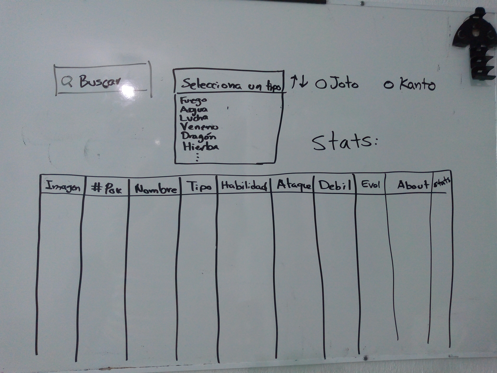
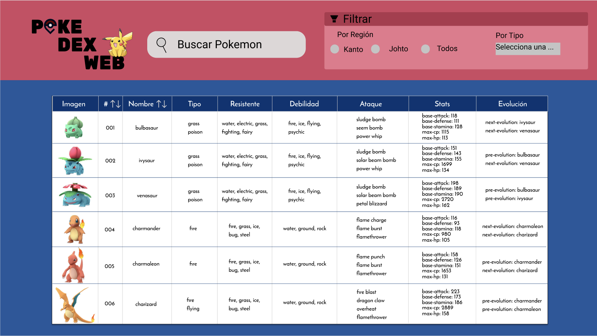
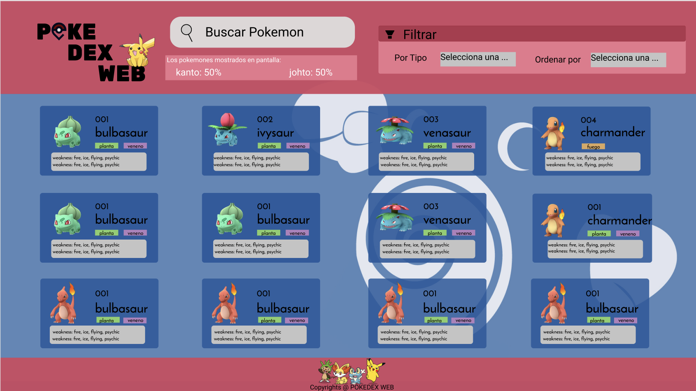

Cynthia Daniela Piña Olivares, 
Isabel Valdés Ochoa 
 < Laboratoria >  

PROYECTO 2, 
Data Lovers

# Data Lovers
Resumen del Proyecto:
PokedexWeb  es una página web de consulta informativa de datos relevantes sobre los pokemones.
Nuestro usuario es una persona que gusta de pokémon y que de igual manera es jugador de Pokémon Go.
El usuario podrá acceder a nuestra página y encontrar información sobre los distintos pokemones.Dicha información se muestra mediante tarjetas donde se visualiza la imagen, número, nombre, región,tipo, fortalezas y debilidades del pokemon. 
El usuario podrá ordenar las tarjetas por número y orden alfabético de forma descendente o ascendente, tendrá la posibilidad de filtrar por tipo y además tiene acceso a un buscador donde podrá escribir el nombre o número del pokémon que necesita. Además para apoyar al usuario en su búsqueda tendrá acceso a una estadística que le muestre el porcentaje de la región a la que pertenecen los pokemones que se están mostrando en pantalla. 
El propósito de todo esto es que el usuario cuente con la información necesaria para jugar de una manera más estratégica en Pokemon Go.

# Sketch de la solución ( prototipo de baja fidelidad ):

  

Listado de problemas que detectaste a través de tests de usabilidad:
- En nuestro prototipo inicial se decidió mostrar la data mediante una tabla, sin embargo se modificó a mostrar mediante tarjetas ya que con una tabla no se lograría la funcionalidad de responsive.
 

 

-Se le colocó más información a las tarjetas como lo es la región y fortalezas y debilidades para que fuera más útil para el usuario.
-Se agregó tabla de estadística para mostrar porcentajes de región.
-Se agregó fondo de pantalla, footer y transparencias para una mayor estética de visualización.
 
# Prototipo de alta fidelidad Final:
 
 
# Página Web:
 

# Historias de Usuario

+ Historia de Usuario 1: Visualizar datos

YO COMO   << Usuario >>
QUIERO QUE   << la página me muestre información de todos los pokemon >>
PARA  << poder elegir aquellos que me interesen >>

 
Criterios de Aceptación:
El usuario debe de poder visualizar la información sin estar registrado a la página
El usuario debe poder visualizar los datos desde cualquier dispositivo (Responsivo)
 
Definición de terminado:
El usuario debe de poder ver todas las tarjetas de todos los pokémon (número, nombre y tipo).
La visualización de la página tendrá que ser igual al prototipo de alta fidelidad antes realizado.
La página sea responsiva.
 
+ Historia de Usuario 2: Ordenar información

YO COMO   << Usuario >>
QUIERO QUE   << la página me ordene la información en orden alfabético o numérico >>
PARA  << poder encontrar los pokemones en un orden específico >>

 
Criterios de Aceptación:
El usuario podrá ordenar los pokemon alfabéticamente de manera ascendente o descendente 
El usuario podrá ordenar los pokemon numéricamente de manera ascendente o descendente 
 
Definición de terminado:
Lograr visualizar las tarjetas según el orden seleccionado en el elemento select 
 
+ Historia de Usuario 3: Filtrar información

YO COMO   << Usuario >>
QUIERO QUE   << la página me filtre las tarjetas de los pokemones por su tipo >>
PARA  << poder elegir mejor a los que quiero >>

 
Criterios de Aceptación:
El usuario puede seleccionar uno de los tipos de los pokémon de la lista proporcionada por el select y en la pantalla aparecerán aquellos que posean ese tipo.
 
Definición de terminado:
Visualizar en la página únicamente las tarjetas que cumplan con el criterio del tipo seleccionado 

+ Historia de Usuario 4: Search bar

YO COMO   << Usuario >>
QUIERO QUE   << pueda escribir en un buscador el nombre o número del pokemon >>
PARA  << poder acceder de una manera más rápida a la información >>

 
Criterios de Aceptación:
El usuario debe de poder encontrar al pokémon de su interés mediante una herramienta de un buscador.
 
Definición de terminado:
Se debe mostrar únicamente  las tarjetas que cumplan con el criterio del nombre o número que el usuario introdujo en el buscador. 

+ Historia de Usuario 5: Función ComputeStats

YO COMO   << Usuario >>
QUIERO   << conocer qué porcentaje de los pokemon pertenece a cada región >>
PARA  << poder saber que tan probable es encontrarlos>>

 
Criterios de Aceptación:
El usuario debe de poder ver el porcentaje de pokémon de cada región (Kanto y Johto) en cualquier momento.
 
Definición de terminado:
En todo momento se debe de mostrar los porcentajes actualizados de cada región, independientemente de si se aplicó un filtro, se ordena o se buscó un pokemon.
En caso de que al realizar una búsqueda no haya ninguna coincidencia con algún pokémon, los porcentajes deben de mostrar 0% en lugar de NaN.

# Links:

+ Figma
https://www.figma.com/file/phSeVyqxUKk01jzxoOslN3/Pokemon

+ Trello
https://trello.com/danielapina1/boards

+ ReadMe.doxc
https://docs.google.com/document/d/1AveCPYnsqg_cN-fEC3AGnzM-9nrLld2J3L66my-IYVs/edit#
